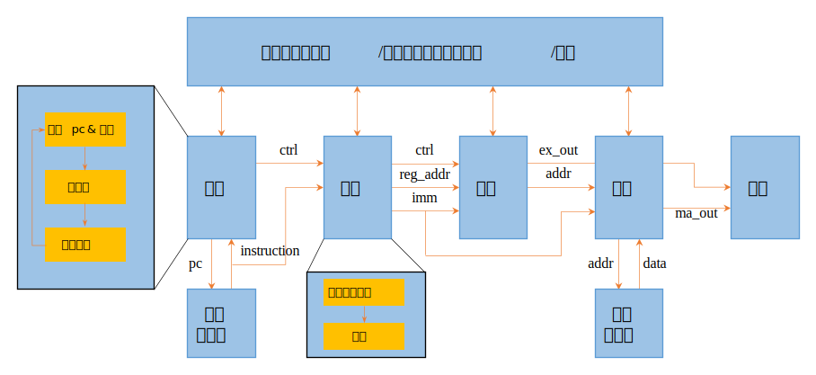

# CPU_RV32

>[!NOTE]
>A five stage pipeline 32-bit CPU based on RISC-V architecture.

## Project Overview

This project has implemented the vast majority of RV32I instructions (except for ecall, ebreak, and csr related instructions), as well as four extensions of M, F, D, and C. Among them, the master branch is RV32IMFD, and another RV32IC branch supports basic integer instructions and C extensions.

In this project, the CPU adopts static branch prediction, and when jumping towards the direction of decreasing PC, it is predicted as a jump. The instruction memory and data memory use Xilinx's Block RAM IP core, while Floating-point arithmetic operations also use Xilinx's floating point operation IP core.

The overall framework of the project is shown in the following figure. Among them, the master branch does not support C extension and does not require the `decompress (压缩指令还原)` module.



## File Structure

```text
cpu_rv32.doc/
├── img/ ---> Images
├── CPU-RV32.md ---> System design document
└── InstructionImplementation.md ---> Instruction implementation document

cpu_rv32.srcs/
├── sim_1/new/ ---> Testbench files
└── sources_1/new/ ---> Source files
    ├── command.vh ---> Macro definition file
    ├── cpu_rv32.v ---> Top file
    ├── cpu_core.v ---> Main code
    └── ***.v ---> Specific functional modules
```
