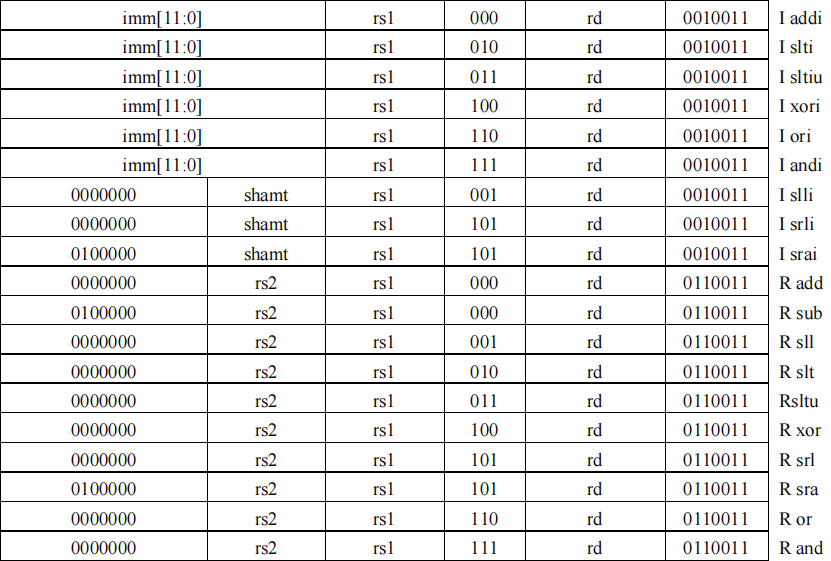
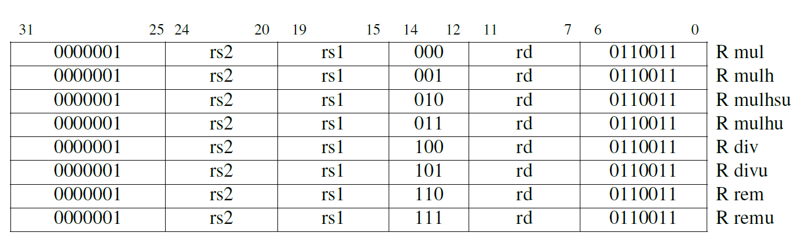
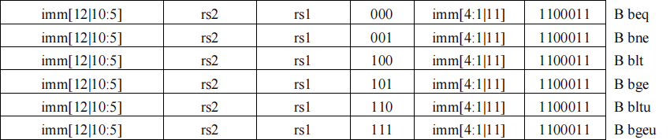
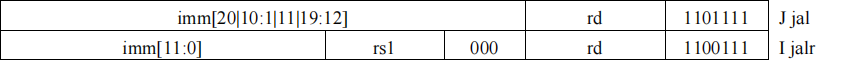
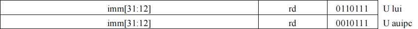
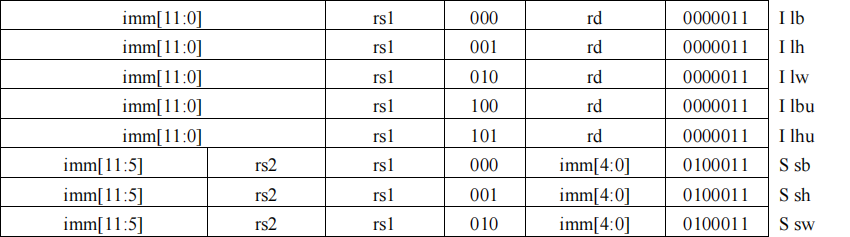

# 指令详解及实现

## 一、整数运算指令

> opcode=7'b0010011（`I-type`）、7'b0110011（`R-type`）

### 1. 基础运算



基础整数运算指令包括加法、减法、逻辑左移、小于则置位、无符号小于则置位、按位异或、逻辑右移、算术右移、按位或、按位与等运算，各自有`I-type`、`R-type`两种指令。

- 减法没有`I-type`，立即数默认为有符号数，所以减法直接用加法加相应的负数即可
- `I-type`的左移和右移都只取低5bit参与运算（因为寄存器的数据位宽为32bit），高位按`funct7`设置

### 2. 乘除法

> opcode=7'b0110011（`R-type`），funct7=7'b0000001



乘除法指令只有`R-type`，包括乘法、求商、取余三类，都包含有/无符号数的计算。

- 乘法相关指令：
  - 2个32bit数相乘的结果可以到64bit，故乘积结果需要分两次获取
  - 可以证明（见文末），相同二进制编码的n位有/无符号数相乘的结果，其低n为都是相同的，故低位只需要一条指令`mul`
  - 对于高位，分`有符号*有符号`、`有符号*无符号`、`无符号*无符号`三条指令
  - Verilog实现：通过给无符号数高位补0、有符号数高位补符号位的方式，把32bit数相乘转为33bit有符号数相乘（Verilog默认是无符号数，使用关键字`signed`转为有符号数），截取低64bit即为结果
- 除法相关指令：
  - 除法的指令分求商、取余两类，各自有有符号数相除、无符号数相除两种
  - Verilog实现：同样通过补位+有符号数运算的方法来同时实现有/无符号数的运算

## 二、分支跳转指令

### 1. 条件分支

> opcode=7'b1100011



条件分支指令根据判断条件的真伪来选择是否跳转，判断条件包括等于、不等于、小于、大于等于、无符号小于、无符号大于等于六种。

- Verilog实现：将条件真伪的结果（真为1、伪为0）作为ALU的输出，程序计数器`pc`根据结果选择+4或跳转到目标位置
- 有符号数的比较方法：根据补码的规则可知，正数（符号位为0）越大，其二进制编码对应的无符号数也越大；负数亦然。所以，比较有符号数时，可以把符号位取反，然后当作无符号数来比较

### 2. 无条件跳转



无条件跳转指令有两条，跳转并链接`jal`、跳转并寄存器链接`jalr`

- 在指令跳转时，把原先应该执行的的下一条指令地址写入目标寄存器`rd`
- `jal`的目标地址为指令中的立即数，`jalr`的地址为源寄存器`rs1`中的值加上立即数
- Verilog实现：在ALU中计算下一条指令的地址，并写入目标寄存器`rd`；跳转的目标地址在给程序计数器`pc`赋值的地方计算

## 三、长立即数指令



寄存器的数据位宽为32bit，但`I-type`指令只能传递12bit的立即数，这就需要长立即数指令来实现高20bit的传递。

### 1. 高位立即数加载

`lui`指令用于加载一个32bit立即数的高20bit。

- 将指令中的20bit立即数左移12位，低位补0，写入目标寄存器`rd`
- Verilog实现：直接看成一个逻辑左移运算即可

### 2. PC加立即数

`auipc`指令用于把一个20bit的立即数左移12位，然后加到程序计数器`pc`上，结果写入目标寄存器`rd`。

## 四、加载和存储指令



除了提供 32 位字（`lw`，`sw`）的加载和存储外，还支持加载有符号和无符号字节和半字（`lb`、`lbu`、`lh`、`lhu`）和存储字节和半字（`sb`、`sh`）。

- RISC-V仅支持小端模式，加载和存储字节/半字都是取低位
- 加载字节/半字时，都要先进行符号扩展（有符号数）或者零扩展（无符号数）后再写入目标寄存器`rd`


## 有/无符号数乘法

> 参考链接：[有符号数乘法运算_ZZZTTTCCC123的博客-CSDN博客_有符号数乘法](https://blog.csdn.net/ZZZTTTCCC123/article/details/121114388)

### 1. 乘法规则

- 无符号数相乘：被乘数与乘数的各位依次相乘后求和（即移位求和）
- 被乘数为有符号数：部分积符号扩展
- 乘数为有符号数：符号位对应的部分积取反加一

```
有符号数相乘示例：

    0101(+5)        1011(-5)        0101(+5)        1011(-5)
  × 0011(+3)      × 0011(+3)      × 1101(-3)      × 1101(-3)
------------------------------------------------------------
00000101        11111011        00000101        11111011
0000101         1111011         0000000         0000000 
000000          000000          000101          111011  
00000           00000           11011           00101   
============================================================
00001111(+15)   11110001(-15)   11110001(-15)   00001111(+15)
```

### 2. 证明：相同编码的n位有/无符号数相乘低n位结果相同

- 被乘数为有符号数时，部分积需要符号扩展（无符号数是零扩展），但扩展的部分都在高n位，低n位是一样的
- 乘数为有符号数时，符号位对应的部分积取反加一，故该部分积的最低位与无符号数相乘时一致；而该部分积只有最低位出现在低n位中，所以低n位是一样的

```
    1011(11)            1011(-5)
  × 1101(13)          × 1101(-3)
--------------------------------
00001011            11111011
0000000             0000000 
001011              111011  
01011               00101   
================================
10001111(143)       00001111(+15)
```


